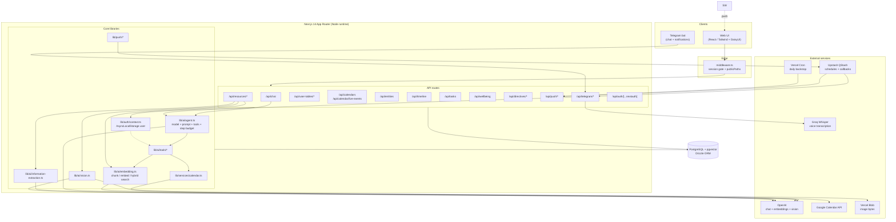
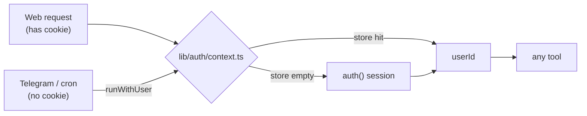
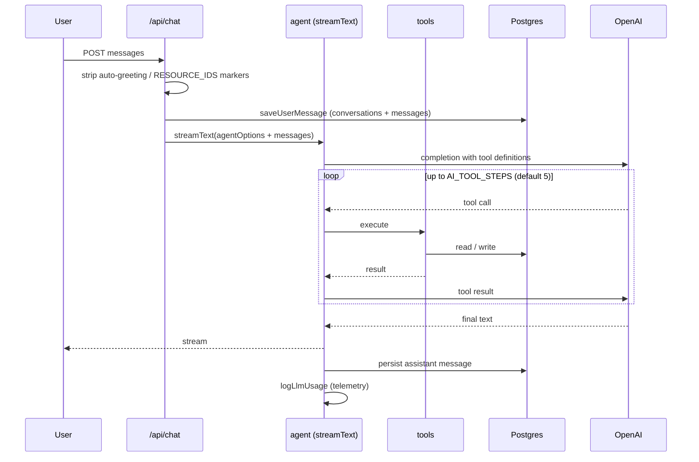
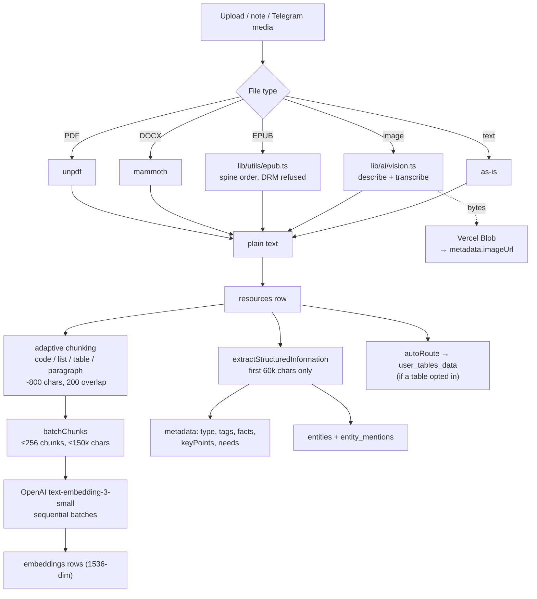
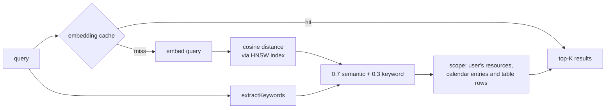
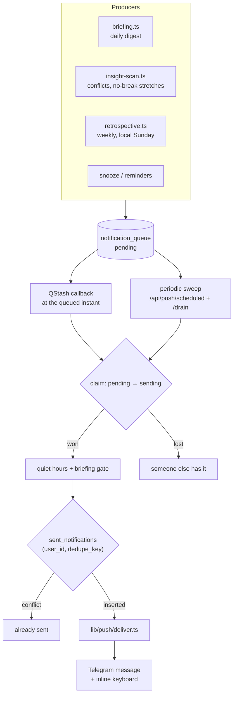
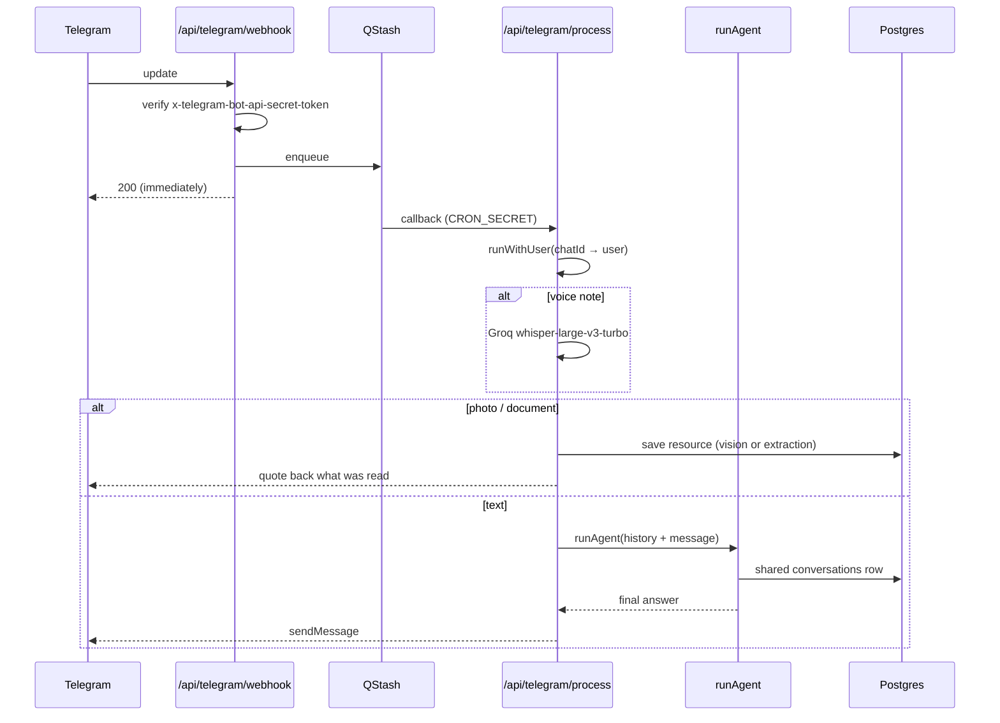
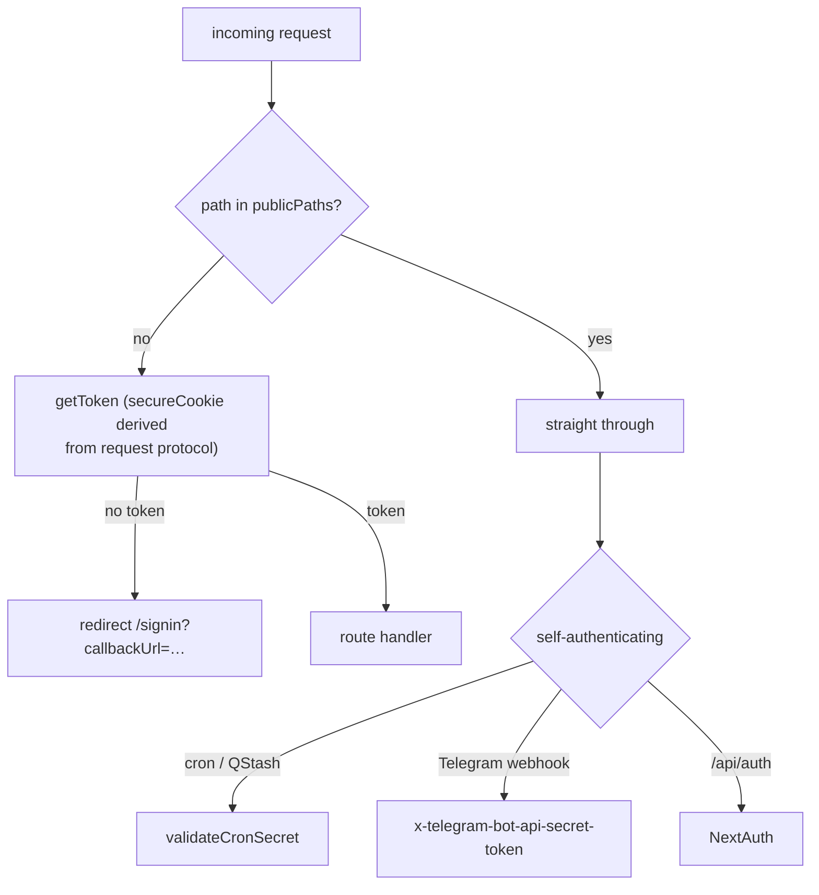
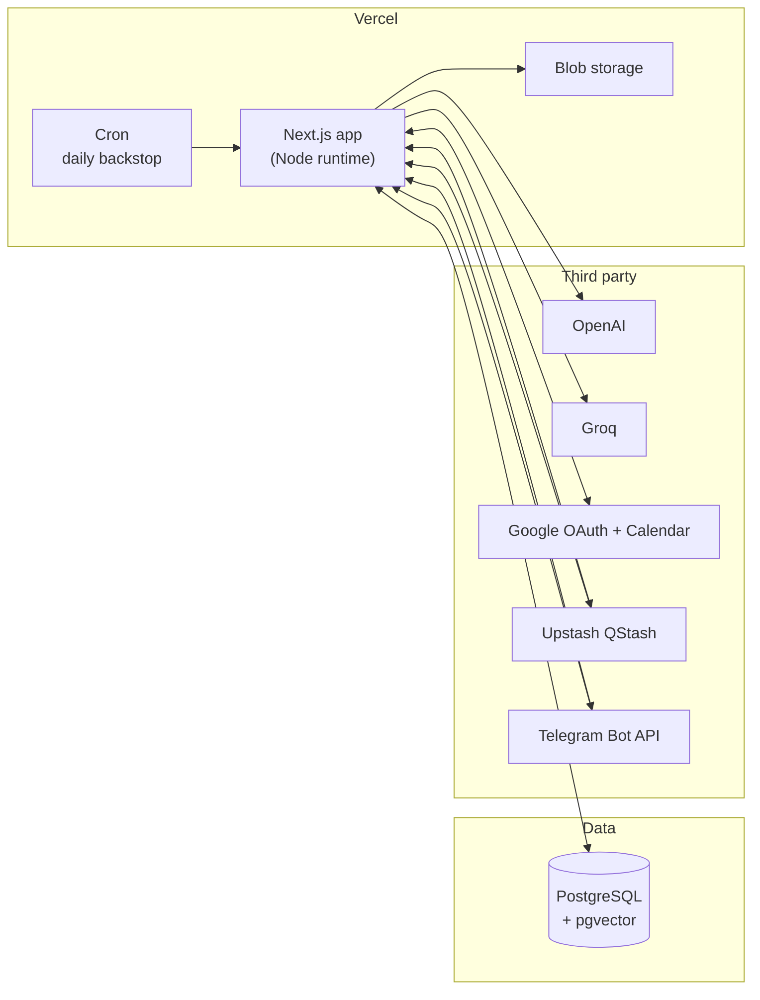

# Architecture

A Next.js 14 (App Router) personal assistant: a RAG knowledge base, Google
Calendar integration, and proactive push notifications, reachable from two
surfaces — the web UI and a Telegram bot — that share one agent and one chat
history.

Companion document: [database-schema.md](./database-schema.md).

---

## 1. System overview

---

## 2. Layers

| Layer | Location | Responsibility |
| --- | --- | --- |
| **UI** | `app/page.tsx`, `app/components/` | Dashboard, chat rail, calendar view, widgets, resource/table/entity pages |
| **API** | `app/api/*/route.ts` | HTTP surface; session or `CRON_SECRET` auth |
| **Agent** | `lib/ai/agent.ts` | The single definition of the assistant |
| **Tools** | `lib/ai/tools/` | What the agent can actually do |
| **Domain actions** | `lib/actions/` | Resource / table / entity / image write paths |
| **Retrieval** | `lib/ai/embedding.ts` | Chunking, batched embedding, hybrid search |
| **Integrations** | `lib/services/`, `lib/storage/`, `lib/telegram/` | Google Calendar, Vercel Blob, Telegram |
| **Notifications** | `lib/push/` | Briefings, insights, retrospective, queue drain |
| **Data** | `lib/db/` | Drizzle schema + client |

### Request context — how a tool knows who is asking

Tools once read the NextAuth session directly, which welded them to a browser
cookie. They now resolve the user through `lib/auth/context.ts`, an
`AsyncLocalStorage` store that falls back to `auth()` when nothing was pushed
onto it.

Consequence: **anything running tools must be on the Node runtime.**
`AsyncLocalStorage` does not exist on Edge. Google access tokens for cookie-less
callers are minted from `accounts.refresh_token` via `lib/auth/google-token.ts`
— the stored `access_token` is never refreshed after sign-in.

---

## 3. Chat flow

Both surfaces build on `agentOptions()`, which is what stops them drifting into
two subtly different assistants. The web streams it; Telegram awaits a finished
answer.

### Tool catalogue (`lib/ai/tools/`)

| Category | Tools |
| --- | --- |
| **Information** | `addResource`, `getInformation` (RAG), `forgetInformation`, `analyzeFile` |
| **Calendar** | `getEvents`, `scheduleEvent`, `deleteEvent`, `optimizeSchedule` |
| **Timeline** | `rememberDate`, `getTimeline` |
| **Tasks** | `addTask`, `getTasks`, `completeTask`, `scheduleTask` |
| **Wellbeing** | `logWellbeing`, `getWellbeing` |
| **Preferences** | `rememberPreference`, `forgetPreference` |
| **Tables** | `createTable`, `addTableRows`, `extractToTable`, `listTables` |

---

## 4. RAG pipeline

### Ingest

Two limits here are load-bearing, both because of books:

- **Batched embedding.** A book chunks into the high hundreds, past OpenAI's
  per-request ceiling of 2048 inputs / 300k tokens. One request per book would
  fail on exactly the uploads this was built for.
- **60k-character extraction window.** A whole book exceeds any chat model's
  context, and an over-long prompt fails both attempts — leaving the book with no
  tags, facts or entities at all.

**Images are stored as text.** A vision model reads the picture once at the door
and its description becomes the resource's `content`, so chunking, embedding,
extraction and search all work unchanged and never learn about a second
modality. The two halves degrade independently on purpose: a failed description
aborts the upload (an unsearchable image is invisible to the assistant), while a
failed blob store only logs. `lib/actions/save-image.ts` owns that ordering so no
surface re-decides it.

### Retrieval

`RAG_TOP_K` defaults to 8. Date filters (`minDate`/`maxDate`) narrow the resource
side only. The query vector is validated to contain finite numbers before it is
interpolated into SQL.

---

## 5. Notifications

Notifications are written to `notification_queue` **first** (durability), then
delivered along two independent paths.

**Cron cadence lives in QStash, not `vercel.json`.** The Hobby plan rejects any
cron firing more than once a day, and these endpoints ask "who is due right
now?" rather than planning a day ahead — so a daily sweep alone drops nearly
every briefing. The three entries in `vercel.json` are a once-a-day backstop for
when QStash is unreachable. **Changing a briefing's cadence means editing the
QStash schedule.**

Cron- and QStash-invoked routes carry no session: they authenticate with
`CRON_SECRET` via `validateCronSecret` and must therefore be listed in
`middleware.ts` `publicPaths`.

See [push-scheduling.md](./push-scheduling.md) for operational detail.

---

## 6. Telegram surface

The immediate 200 exists because Telegram redelivers anything it does not get a
prompt answer for; the real work happens in the QStash callback.

Photos and documents are **saved, not discussed**: they arrive with no question
attached, so `processUpdate` ends the turn on them rather than feeding a wall of
OCR to the agent and burning its step budget. The reply quotes back what was
actually read, because vision output is the one thing here the user cannot
verify against a source — a misread figure on a receipt has to be caught while
the paper is still in hand.

Chat history is shared with the web chat (same `conversations` row), so a thread
continues across surfaces.

---

## 7. Auth and route protection

NextAuth v5 (beta), Google OAuth, JWT strategy with automatic token refresh
(`app/api/auth/auth.ts`). Scopes include Calendar read/write.

`/api/telegram/link` is deliberately **absent** from `publicPaths` — issuing a
link code requires a signed-in user, and `startsWith` would have made a bare
`/api/telegram` cover it.

---

## 8. Deployment topology

> Vercel Blob has no private tier — every object is served publicly and the
> unguessable URL is the only protection. Nothing harmful-if-leaked belongs there.

---

## 9. Configuration

Validated with `@t3-oss/env-nextjs` in `lib/env.mjs`. `SKIP_ENV_VALIDATION=1`
bypasses validation for build/CI.

| Variable | Required | Purpose |
| --- | --- | --- |
| `DATABASE_URL` | ✅ | Postgres connection |
| `OPENAI_API_KEY` | ✅ | Chat, embeddings, vision |
| `NEXTAUTH_SECRET`, `NEXTAUTH_URL` | ✅ | Session encryption / callback base |
| `GOOGLE_CLIENT_ID`, `GOOGLE_CLIENT_SECRET` | ✅ | OAuth + Calendar |
| `ALLOWED_EMAILS` | — | Who may sign in; unset means anyone with a Google account |
| `AI_CHAT_MODEL` | — | Chat model (default `gpt-4o-mini`) |
| `AI_VISION_MODEL` | — | Vision model (defaults to the chat model) |
| `AI_EMBED_MODEL` | — | Embedding model |
| `AI_TOOL_STEPS` | — | Agent step budget (default 5) |
| `EMBED_CHUNK_SIZE` / `EMBED_CHUNK_OVERLAP` | — | Chunking (defaults 800 / 200) |
| `RAG_TOP_K` | — | Retrieval breadth (default 8) |
| `CRON_SECRET` | — | Auth for cron / QStash / Telegram callbacks |
| `QSTASH_TOKEN`, `APP_URL` | — | Scheduling and callback base URL |
| `TELEGRAM_BOT_TOKEN`, `TELEGRAM_WEBHOOK_SECRET` | — | Telegram surface |
| `GROQ_API_KEY` | — | Voice transcription |
| `BLOB_READ_WRITE_TOKEN` | — | Image storage |

Path alias `@/*` maps to the project root (`tsconfig.json`, `vite.config.ts`).
Tests live in `test/`, run with Vitest.
