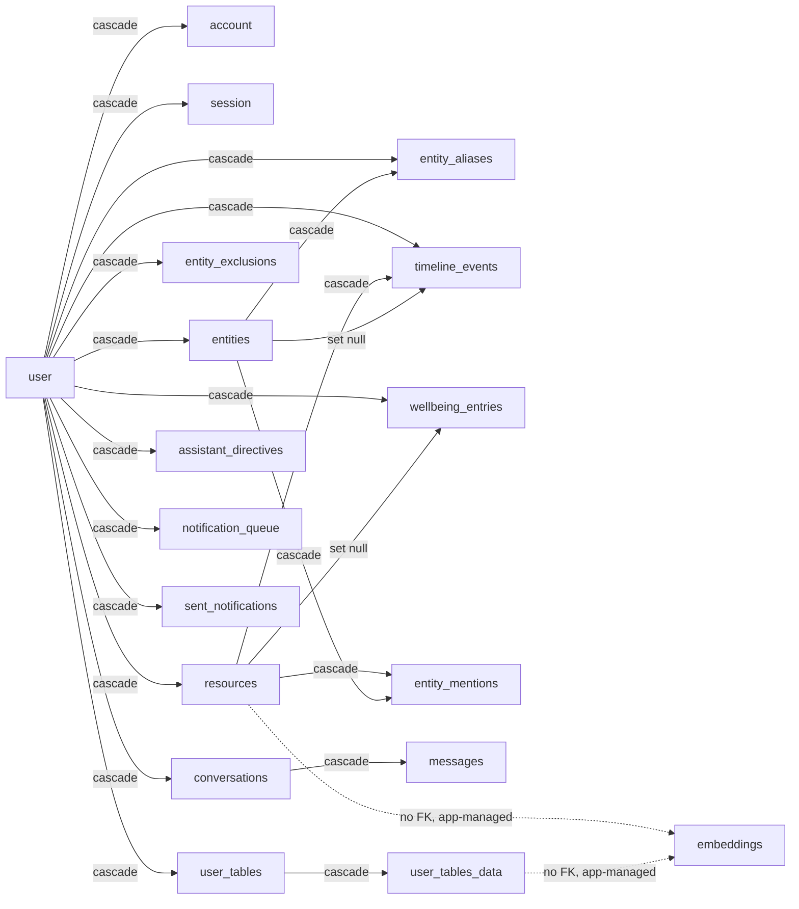

# Database schema

PostgreSQL with the **pgvector** extension, managed through Drizzle ORM.
Schema definitions live in `lib/db/schema/`, migrations in `drizzle/`.

Three ID conventions coexist and are not interchangeable:

| Convention | Used by | Why |
| --- | --- | --- |
| `uuid` (`defaultRandom`) | NextAuth tables, push tables | What the NextAuth Drizzle adapter expects |
| `varchar(191)` nanoid | resources, embeddings, entities, chat, tables | Short, URL-safe, generated in app code before insert |
| composite PK | `account`, `verificationToken`, `entity_mentions` | The pair *is* the identity; no surrogate key needed |

---

## Entity–relationship diagram

```mermaid
erDiagram
    user ||--o{ account : "has"
    user ||--o{ session : "has"
    user ||--o{ resources : "owns"
    user ||--o{ entities : "owns"
    user ||--o{ entity_aliases : "owns"
    user ||--o{ entity_exclusions : "owns"
    user ||--|| conversations : "owns"
    user ||--o{ user_tables : "owns"
    user ||--o{ timeline_events : "owns"
    user ||--o{ tasks : "owns"
    user ||--o{ wellbeing_entries : "owns"
    user ||--o{ assistant_directives : "owns"
    user ||--o{ notification_queue : "owns"
    user ||--o{ sent_notifications : "owns"

    resources ||--o{ entity_mentions : "evidences"
    entities  ||--o{ entity_mentions : "mentioned in"
    entities  ||--o{ entity_aliases : "answers to"
    resources ||--o{ timeline_events : "evidences"
    entities  ||--o{ timeline_events : "is about"
    resources ||--o{ tasks : "evidences"
    resources ||--o{ task_suggestions : "proposes from needs"
    tasks     ||--o{ task_completions : "closed on"
    resources ||--o{ wellbeing_entries : "searchable copy of"

    conversations ||--o{ messages : "contains"
    user_tables   ||--o{ user_tables_data : "contains"

    resources        ||..o{ embeddings : "source_id (soft FK)"
    user_tables_data ||..o{ embeddings : "source_id (soft FK)"

    user {
        uuid id PK
        text email UK
        text name
        text image
        timestamp emailVerified
        text telegram_chat_id UK
        text telegram_link_code
        timestamp telegram_link_expires_at
        jsonb followed_calendars
        text timezone
        integer briefing_hour
        boolean briefing_enabled
        boolean proactive_enabled
        integer retro_hour
        boolean retro_enabled
        integer quiet_hours_start
        integer quiet_hours_end
        text locale
        timestamp created_at
        timestamp updated_at
    }

    account {
        uuid userId FK
        text provider PK
        text providerAccountId PK
        text type
        text refresh_token
        text access_token
        integer expires_at
        text scope
        text id_token
    }

    session {
        text sessionToken PK
        uuid userId FK
        timestamp expires
    }

    verificationToken {
        text identifier PK
        text token PK
        timestamp expires
    }

    resources {
        varchar id PK
        uuid user_id FK
        text title
        text content
        enum source "resource|calendar"
        text google_event_id
        jsonb metadata
        timestamp created_at
        timestamp updated_at
    }

    embeddings {
        varchar id PK
        varchar source_id "resources.id or user_tables_data.id"
        enum source "resource|calendar|table"
        text google_event_id
        text content
        vector embedding "1536 dims, HNSW"
        jsonb metadata
    }

    entities {
        varchar id PK
        uuid user_id FK
        text name
        text normalized_name
        text type
        text relationship
        jsonb attributes
        integer mention_count
        timestamp created_at
        timestamp updated_at
    }

    entity_mentions {
        varchar entity_id PK
        varchar resource_id PK
        text context
        timestamp created_at
    }

    conversations {
        varchar id PK
        uuid user_id FK
        text title
        timestamp created_at
    }

    messages {
        varchar id PK
        varchar conversation_id FK
        enum role "user|assistant|system"
        text content
        timestamp created_at
    }

    user_tables {
        varchar id PK
        uuid user_id FK
        text title
        text description
        jsonb columns
        jsonb settings
        timestamp created_at
        timestamp updated_at
    }

    user_tables_data {
        varchar id PK
        varchar user_table_id FK
        jsonb row_data
        jsonb metadata
        timestamp created_at
        timestamp updated_at
    }

    tasks {
        varchar id PK
        uuid user_id FK
        text title
        text note
        text status "open|done|dropped"
        date due_on "the deadline, never sent to Google"
        date scheduled_for "the day of work, which IS the event"
        text scheduled_start "offset-bearing ISO, or null for all-day"
        text scheduled_end
        text google_event_id
        text google_calendar_id
        text priority "high|medium|low"
        text area
        text recurrence "none|daily|weekly|monthly|annual"
        integer recurrence_interval
        timestamp completed_at
        varchar resource_id FK
        text source "user|extraction|telegram"
        timestamp created_at
        timestamp updated_at
    }

    task_completions {
        varchar id PK
        uuid user_id FK
        varchar task_id FK
        date completed_on
        date due_on "which occurrence this closed"
        timestamp created_at
    }

    task_suggestions {
        varchar id PK
        uuid user_id FK
        varchar resource_id FK
        text need_key
        text reason "accepted|dismissed"
        varchar task_id FK
        timestamp created_at
    }

    notification_queue {
        uuid id PK
        uuid user_id FK
        timestamp notify_at
        jsonb payload
        text kind
        text status "pending|sending|sent|failed"
        text attempts
        timestamp claimed_at
        timestamp sent_at
        timestamp created_at
    }

    sent_notifications {
        uuid id PK
        uuid user_id FK
        text dedupe_key
        text kind
        timestamp sent_at
    }
```

---

## Table groups

### 1. Identity — `user`, `account`, `session`, `verificationToken`

Standard NextAuth v5 tables (`lib/db/schema/auth.ts`), with the app's own
per-user settings living directly on `user` rather than a side table:

- **Telegram link** — `telegram_chat_id` is unique because one chat speaks for
  exactly one person. `telegram_link_code` + `telegram_link_expires_at` are the
  one-shot code the web app issues and `/start <code>` redeems.
- **`followed_calendars`** — JSONB array of `{ calendarId, summary? }`. Kept on
  the user row rather than a `calendars` table because it is read whole, always,
  and never joined.
- **`timezone`** — IANA zone synced from Google Calendar settings. Cron runs in
  UTC; this column is what turns "9 AM" into a real instant.
- **Notification preferences** — `briefing_*`, `retro_*`, `proactive_enabled`,
  `quiet_hours_*`. Quiet hours wrap past midnight when `start > end`.

`account.refresh_token` is the durable Google credential. `account.access_token`
is **never refreshed after sign-in** and must not be trusted — see
`lib/auth/google-token.ts`.

### 2. Knowledge base — `resources`, `embeddings`

`resources` is the document layer: one row per note, upload, image or synced
calendar event. `metadata` is a validated-on-write JSONB blob
(`resourceMetadataSchema`) carrying the extraction output — `type`, `tags`,
`facts[]`, `entities[]`, `needs[]`, `keyPoints[]` — plus image fields
(`imageUrl`, `imagePathname`, `caption`) and `linkedRows[]` back-links into user
tables.

`embeddings` is the retrieval layer. **`source_id` is a polymorphic soft foreign
key with no DB constraint**, resolved by the `source` column:

| `source` | `source_id` points at | Cleanup |
| --- | --- | --- |
| `resource` | `resources.id` | Deleted explicitly by `deleteResource` |
| `calendar` | `resources.id` (a synced event) | Same |
| `table` | `user_tables_data.id` | Deleted explicitly by table actions |

Because there is no `ON DELETE CASCADE` here, embedding rows are removed in
application code. A row deleted around the ORM leaves orphan vectors.

Indexes: HNSW on `embedding` with `vector_cosine_ops` — this is what lets
`ORDER BY embedding <=> query` use the index instead of a sequential scan — plus
btree on `source_id` and `source`.

### 3. Entity graph — `entities`, `entity_mentions`, `entity_aliases`, `entity_exclusions`

The nodes over the document pile. Extraction finds people, projects and
organisations inside a note; without this layer three notes mentioning the same
person hold three unrelated strings and nothing can answer "what do I know about
Marta?".

- `normalized_name` is lowercased and whitespace-collapsed **purely for
  matching**; `name` is what gets displayed.
- `entities_identity_unique (user_id, normalized_name, type)` is the merge rule.
  Two different people with the same name collide here — a deliberate trade,
  since merging is recoverable and a silently split graph is not.
- `mention_count` is denormalised because the entity list sorts by it on every
  render.
- `entity_mentions` is the edge, with `context` holding the sentence that
  produced it so the UI can show *why* the link exists.
- `relationship_source` (`model` | `user`) is why a hand-set relationship is not
  overwritten on the next mention: the upsert compares the *stored* source, and
  a merge keeps the user's answer from whichever side it came from.

`entities` is a **projection**, rebuilt by `syncEntitiesForResource` from every
note's `metadata.entities`. That is the whole reason the next two tables exist —
editing or deleting a row alone lasts only until the next note mentions the name.

- **`entity_aliases`** — spellings the user has decided mean an existing node.
  Written by a merge and by a rename, and consulted before any upsert, so the
  decision survives re-extraction. Without it a merge is undone by the next note.
- **`entity_exclusions`** — the mirror: names the user has decided are *not*
  nodes at all. An alias says a spelling means that node; an exclusion says it
  means nothing. Keyed on the same `(user_id, normalized_name, type)` triple as
  `entities_identity_unique`, and deliberately carries no FK to `entities` — the
  row has to outlive the node it buried. Deleting is therefore recoverable:
  nothing the user wrote is touched, so `restoreEntity` replays the sync over the
  notes that still name it.

### 4. Chat — `conversations`, `messages`

One `conversations` row per user thread, shared across **both** surfaces: the web
chat and Telegram write to the same row, which is why a thread continues across
them.

- `conversations_user_unique` on `user_id` is what makes "one row" true rather
  than merely intended. Three call sites did "select … limit 1, else insert";
  two first messages arriving together — plausible precisely because the two
  surfaces share the row — created two conversations, after which an unordered
  `limit 1` could hand the reader and the writer different threads. The single
  get-or-create is `lib/chat/conversation.ts`.
- `messages.seq` (bigserial, unique) is the order messages were written in and
  the cursor history pages on. `created_at` can do neither job: `persistTurn`
  inserts a turn's question and answer in one statement, so both carry the same
  `now()` — ordering on it leaves the pair undefined, and a `created_at < before`
  cursor silently drops whichever of the two a page ended on.

### 5. User tables — `user_tables`, `user_tables_data`

Schema-in-JSONB: `user_tables.columns` holds the column definitions
(`tableColumnSchema`), `user_tables_data.row_data` holds one row keyed by column
ID. `settings.autoRoute` is the opt-in rule that turns matching new resources
into rows with zero LLM calls, by mapping extracted metadata onto columns by
name.

Every row is separately embedded (`source = 'table'`), so table contents are
reachable through the same RAG search as documents.

### 6. Notifications — `notification_queue`, `sent_notifications`

There is no subscription table. Delivery is Telegram, and `user.telegram_chat_id`
— unique, set by redeeming a link code — is the whole of an account's
reachability. `push_subscriptions` was dropped in `0017` along with Web Push.
- **`notification_queue`** — durable "deliver this later" state, because a
  serverless function cannot hold a `setTimeout` across invocations. The
  `pending → sending → sent|failed` transition is the lock: both the QStash
  callback for a row and the periodic sweep can reach it, and the move out of
  `pending` is what stops them both sending. `claimed_at` measures staleness from
  the claim, not from enqueue time. `attempts` bounds retries: a send Telegram
  rejects returns the row to `pending` rather than retiring it, but only until
  the count runs out — otherwise a chat the user has blocked is retried forever.
  An account with no chat linked is retired on the first try instead, since no
  later sweep would make a missing link appear.
  Index `(status, notify_at)` matches the drain query exactly.
- **`sent_notifications`** — the dedupe ledger. The
  `(user_id, dedupe_key)` unique constraint *is* the once-only guarantee: an
  insert that conflicts means "already sent". Keys are caller-defined and stable,
  e.g. `briefing:2026-07-21`, `event:<googleEventId>:<startISO>`.

### 7. Timeline — `timeline_events`

One row per dated thing worth finding years later: births, moves, weddings, first
days, trips, diagnoses. The projection of every note's `metadata.dates` onto one
ordered axis, exactly as `entities` is the projection of its `metadata.entities`.
A date is stored twice on purpose — the note keeps its wording and stays
searchable, this keeps the day, because no amount of embedding puts prose in
order.

Two columns that look alike and are not:

- **`precision`** (`day` | `month` | `year` | `day-month`) says which components
  of `occurred_on` are real. "We moved in 2022" is a year, and a bare `date`
  column would turn it into 1 January and print it back as if someone had said
  so. `day-month` — a birthday with no year — stores `PLACEHOLDER_YEAR` (2000, a
  leap year, so `--02-29` survives), never prints it, and stays off the
  historical axis entirely: it has no origin, only occurrences ahead of it.
- **`recurrence`** (`none` | `annual`) is orthogonal. A wedding on a known day
  recurs; a known-to-the-day hospital visit does not.

`resource_id` **cascades** (the note is the evidence) while `entity_id` **sets
null** (losing a node is no reason to forget when someone's child was born). A
date the user stated outright via `rememberDate` has neither, so nothing that
happens in the knowledge base can touch it. Identity is
`(user_id, occurred_on, kind, subject_key, lower(btrim(title)))` — deliberately
conservative, since a visible duplicate can be deleted and a silently swallowed
second event on the same day cannot be recovered.

### 8. Tasks — `tasks`, `task_completions`, `task_suggestions`

The things that have to be done. `metadata.needs` had been extracting exactly
this shape from every note for months with no reader, while
`DATE_EXTRACTION_RULES` refused deadlines from the timeline on the grounds that
they belonged to a tasks layer that did not exist — so a deadline landed nowhere
at all.

Two columns that look alike and are not:

- **`due_on`** is the last acceptable day. It never leaves this app: a deadline
  is not an appointment, and writing it to a calendar claims a day the user never
  agreed to spend.
- **`scheduled_for`** is the day they committed to *doing* it, which may be any
  day at or before the deadline. This one **is** the calendar event, tracked by
  `google_event_id`. Without an hour it is written all-day and
  `transparency: 'transparent'`, so it holds no time and neither blocks a meeting
  nor appears in the briefing schedule beside its own line in the tasks block;
  with an hour it is an ordinary opaque event.

Keeping only one of them is wrong in one of two ways — only the deadline and a
task is silent for the fortnight it could have been done in, only the working day
and nothing knows Friday is the last chance. A task with neither is the ordinary
"sometime" item.

Identity is `(user_id, lower(btrim(title)), coalesce(due_on, DATE '1970-01-01'))`
**`WHERE status = 'open'`** — partial *and* expression, so drizzle can express
neither and it lives only in migration 0027. **Never `db:push` this table**, same
hazard as `timeline_events`. Partial because a task done in March and raised
again in August is a new one; `coalesce` because Postgres treats NULLs as
distinct and two undated tasks with one title would otherwise both insert. It
catches case and outer whitespace and deliberately not internal whitespace or
word order — a visible duplicate can be deleted, a silently swallowed task cannot
be recovered.

`task_completions` is one row per closing, which is the only past a recurring
task has: a single row that rolls its due date forward knows when it is next due
and nothing about last week. `UNIQUE (task_id, completed_on)` is load-bearing
rather than tidy — Telegram's `clearReplyMarkup` is best-effort, so the same
button can fire twice and rolling twice would silently skip an occurrence.

`task_suggestions` records decisions only, accept and dismiss alike. The
suggestions themselves have no rows: they are computed from every note's
`metadata.needs` minus this table, the mirror of `entity_exclusions`, because a
suggestion is a *reading* of a note and materialising readings means keeping them
in step with notes that get edited, merged and compacted.

`resource_id` **cascades** on both `tasks` and `task_suggestions` (the note is
the evidence); a task the user typed has none.

### 9. Wellbeing — `wellbeing_entries`

Mood, energy, sleep and symptoms, logged conversationally. State is stored twice
for the same reason dates are: the scales go here where a chart can read them,
the user's own words go to `resources` (via `resource_id`) where retrieval can.
The row is written first and the note indexed after — the measurement costs one
INSERT and must not be lost to a failing embedding call.

- **One row per check-in, never one per day.** "Fine in the morning, headache
  after lunch" is two measurements and the time between them is the point.
  Folding to one point per day happens at read time in `lib/wellbeing/aggregate.ts`.
- `local_date` is denormalised because charts group by local day, and
  re-deriving that from a UTC instant applies today's offset to an entry made
  before a DST change.
- `sleep_minutes` is an integer because "7 h 20 m" as a float comes back out as
  something else.
- The 1–5 scale is enforced in zod **and** as a SQL CHECK: a 7 on a 1–5 axis is
  not a bad reading, it is a broken chart.

### 10. Response preferences — `assistant_directives`

Standing instructions about how the assistant should answer — language, length,
format, what to skip. These are **prepended to every system prompt, not
retrieved**, which is the whole point: a preference stored as a resource is only
found when something searches for it, and nothing searches before answering
"what's on tomorrow?".

Capped at 20 rows × 200 characters, the length enforced in zod and as a SQL
CHECK. The caps are the difference between a preference memory and a slowly
rotting system prompt — these compete with the user's actual question for
attention. Hitting the cap is reported to the model, never resolved by evicting
the oldest: the user typed each of these. `source` (`user` | `inferred`) changes
nothing about how a rule is followed; it exists so the settings screen can show
that a rule was the model's reading of a repeated correction and was never asked
for.

---

## Cascade map

Everything hangs off `user` with `ON DELETE CASCADE`, so deleting a user removes
their entire footprint — except the `embeddings` rows, which have no FK and are
cleaned up in application code.

`entity_exclusions` deliberately hangs off `user` alone: a tombstone that
cascaded from the entity it buried would be deleted by the very operation it
records.
