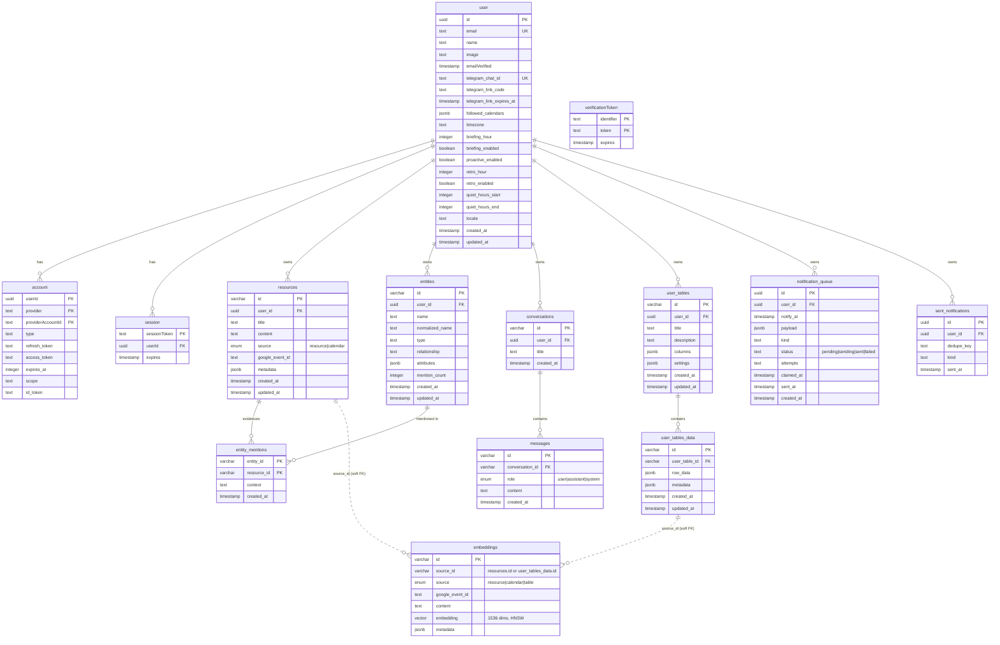
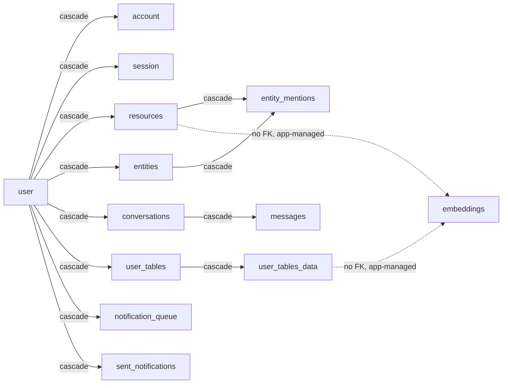

# Database schema

PostgreSQL with the **pgvector** extension, managed through Drizzle ORM.
Schema definitions live in `lib/db/schema/`, migrations in `drizzle/`.

Three ID conventions coexist and are not interchangeable:

| Convention | Used by | Why |
| --- | --- | --- |
| `uuid` (`defaultRandom`) | NextAuth tables, push tables | What the NextAuth Drizzle adapter expects |
| `varchar(191)` nanoid | resources, embeddings, entities, chat, tables | Short, URL-safe, generated in app code before insert |
| composite PK | `account`, `verificationToken`, `entity_mentions` | The pair *is* the identity; no surrogate key needed |

---

## Entity–relationship diagram

---

## Table groups

### 1. Identity — `user`, `account`, `session`, `verificationToken`

Standard NextAuth v5 tables (`lib/db/schema/auth.ts`), with the app's own
per-user settings living directly on `user` rather than a side table:

- **Telegram link** — `telegram_chat_id` is unique because one chat speaks for
  exactly one person. `telegram_link_code` + `telegram_link_expires_at` are the
  one-shot code the web app issues and `/start <code>` redeems.
- **`followed_calendars`** — JSONB array of `{ calendarId, summary? }`. Kept on
  the user row rather than a `calendars` table because it is read whole, always,
  and never joined.
- **`timezone`** — IANA zone synced from Google Calendar settings. Cron runs in
  UTC; this column is what turns "9 AM" into a real instant.
- **Notification preferences** — `briefing_*`, `retro_*`, `proactive_enabled`,
  `quiet_hours_*`. Quiet hours wrap past midnight when `start > end`.

`account.refresh_token` is the durable Google credential. `account.access_token`
is **never refreshed after sign-in** and must not be trusted — see
`lib/auth/google-token.ts`.

### 2. Knowledge base — `resources`, `embeddings`

`resources` is the document layer: one row per note, upload, image or synced
calendar event. `metadata` is a validated-on-write JSONB blob
(`resourceMetadataSchema`) carrying the extraction output — `type`, `tags`,
`facts[]`, `entities[]`, `needs[]`, `keyPoints[]` — plus image fields
(`imageUrl`, `imagePathname`, `caption`) and `linkedRows[]` back-links into user
tables.

`embeddings` is the retrieval layer. **`source_id` is a polymorphic soft foreign
key with no DB constraint**, resolved by the `source` column:

| `source` | `source_id` points at | Cleanup |
| --- | --- | --- |
| `resource` | `resources.id` | Deleted explicitly by `deleteResource` |
| `calendar` | `resources.id` (a synced event) | Same |
| `table` | `user_tables_data.id` | Deleted explicitly by table actions |

Because there is no `ON DELETE CASCADE` here, embedding rows are removed in
application code. A row deleted around the ORM leaves orphan vectors.

Indexes: HNSW on `embedding` with `vector_cosine_ops` — this is what lets
`ORDER BY embedding <=> query` use the index instead of a sequential scan — plus
btree on `source_id` and `source`.

### 3. Entity graph — `entities`, `entity_mentions`

The nodes over the document pile. Extraction finds people, projects and
organisations inside a note; without this layer three notes mentioning the same
person hold three unrelated strings and nothing can answer "what do I know about
Marta?".

- `normalized_name` is lowercased and whitespace-collapsed **purely for
  matching**; `name` is what gets displayed.
- `entities_identity_unique (user_id, normalized_name, type)` is the merge rule.
  Two different people with the same name collide here — a deliberate trade,
  since merging is recoverable and a silently split graph is not.
- `mention_count` is denormalised because the entity list sorts by it on every
  render.
- `entity_mentions` is the edge, with `context` holding the sentence that
  produced it so the UI can show *why* the link exists.

### 4. Chat — `conversations`, `messages`

One `conversations` row per user thread, shared across **both** surfaces: the web
chat and Telegram write to the same row, which is why a thread continues across
them.

### 5. User tables — `user_tables`, `user_tables_data`

Schema-in-JSONB: `user_tables.columns` holds the column definitions
(`tableColumnSchema`), `user_tables_data.row_data` holds one row keyed by column
ID. `settings.autoRoute` is the opt-in rule that turns matching new resources
into rows with zero LLM calls, by mapping extracted metadata onto columns by
name.

Every row is separately embedded (`source = 'table'`), so table contents are
reachable through the same RAG search as documents.

### 6. Notifications — `notification_queue`, `sent_notifications`

There is no subscription table. Delivery is Telegram, and `user.telegram_chat_id`
— unique, set by redeeming a link code — is the whole of an account's
reachability. `push_subscriptions` was dropped in `0017` along with Web Push.
- **`notification_queue`** — durable "deliver this later" state, because a
  serverless function cannot hold a `setTimeout` across invocations. The
  `pending → sending → sent|failed` transition is the lock: both the QStash
  callback for a row and the periodic sweep can reach it, and the move out of
  `pending` is what stops them both sending. `claimed_at` measures staleness from
  the claim, not from enqueue time. `attempts` bounds retries: a send Telegram
  rejects returns the row to `pending` rather than retiring it, but only until
  the count runs out — otherwise a chat the user has blocked is retried forever.
  An account with no chat linked is retired on the first try instead, since no
  later sweep would make a missing link appear.
  Index `(status, notify_at)` matches the drain query exactly.
- **`sent_notifications`** — the dedupe ledger. The
  `(user_id, dedupe_key)` unique constraint *is* the once-only guarantee: an
  insert that conflicts means "already sent". Keys are caller-defined and stable,
  e.g. `briefing:2026-07-21`, `event:<googleEventId>:<startISO>`.

---

## Cascade map

Everything hangs off `user` with `ON DELETE CASCADE`, so deleting a user removes
their entire footprint — except the `embeddings` rows, which have no FK and are
cleaned up in application code.

